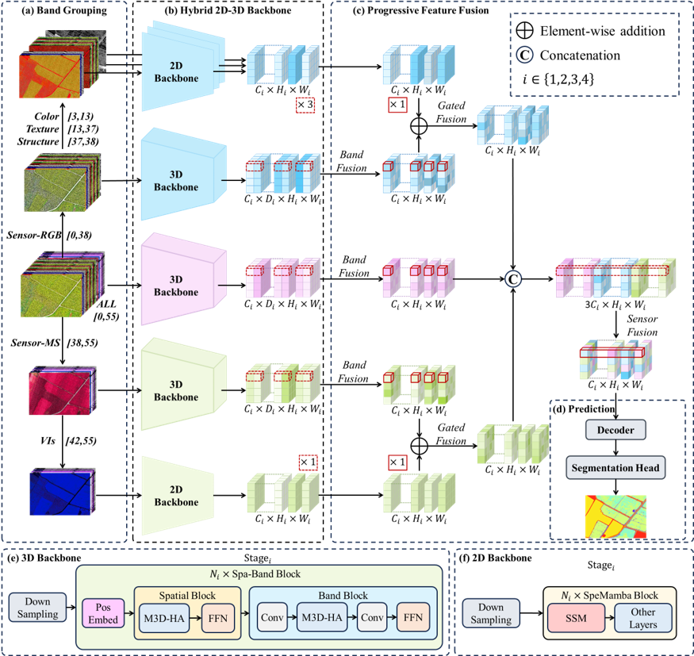
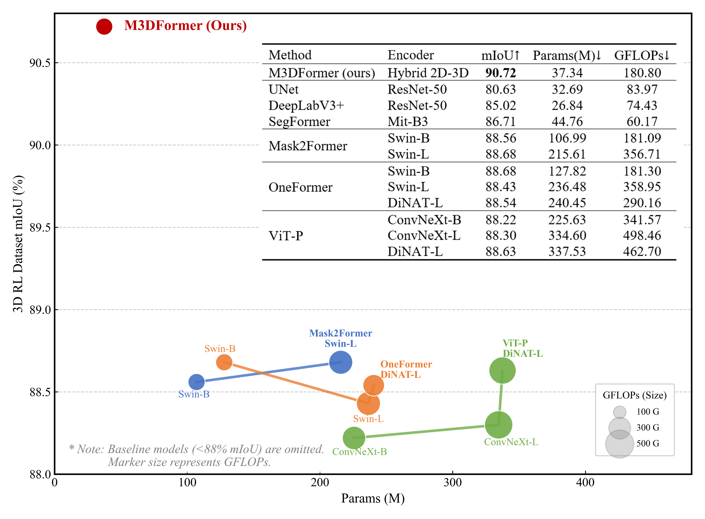

# **M3DFormer: Multi-branch 3D Transformer Architecture for Rice Lodging Segmentation with UAV Multimodal Fusion**

[](LICENSE) [](https://pytorch.org/)


## 🚀 Architecture & Performance

### 1. Overall Architecture
M3DFormer integrates a **Hybrid 2D-3D Backbone**, **M3D-Hybrid Attention (M3D-HA)**, and **Progressive Feature Fusion** to robustly capture spatial-spectral context for precise lodging grading.

<div align="center">
  
</div>


### 2. Accuracy vs. Efficiency
M3DFormer achieves SOTA results (**90.72% **mIoU), significantly outperforming current benchmarks in terms of the accuracy-efficiency trade-off.

<div align="center">
  
</div>

---

## 🛠️ Installation

We strongly recommend using **Linux** with **CUDA 12.x** (compatible with PyTorch 2.x).

### 1. Create Environment
```bash
conda create -n m3dformer python=3.12
conda activate m3dformer
```

### 2. Install PyTorch

Ensure your PyTorch CUDA version matches your system's CUDA driver.

```bash
pip install torch==2.7.0 torchvision==0.22.0 torchaudio==2.7.0 --index-url https://download.pytorch.org/whl/cu126
```

### 3. Install Common Dependencies

```bash
pip install -r requirements.txt
```

### 4. Install CUDA Kernels

These modules require compilation from source. Please ensure `nvcc` is available and matches your PyTorch CUDA version.

**a. Compile Mamba & Causal Conv1d (From Source)**

> Reference: [Mamba-SSM](https://github.com/state-spaces/mamba)

Compiling from source ensures the kernels match your local CUDA version.

```bash
# 1. Install mamba-ssm
git clone https://github.com/state-spaces/mamba.git
cd mamba
git checkout v2.2.6  # Switch to the tested version
MAMBA_FORCE_BUILD=TRUE pip install . --no-build-isolation
cd ..
# rm -rf mamba
```

**b. Compile Selective Scan (VMamba)**

> Reference: [VMamba](https://github.com/MzeroMiko/VMamba) Since the kernel is not included in this repo, please clone and install it manually:

```bash
# 1. Clone the VMamba repository
git clone https://github.com/MzeroMiko/VMamba.git

# 2. Navigate to the kernel directory
cd VMamba/kernels/selective_scan

# 3. Compile and install
pip install . --no-build-isolation

# 4. Return to project root (Optional: remove the cloned repo to save space)
cd ../../../
# rm -rf VMamba
```

## 🚄 Training & Evaluation

We provide easy-to-use scripts based on [PyTorch Lightning](https://www.pytorchlightning.ai/). All configurations are managed via YAML files in the `configs/` directory.

### 1. Training

**Single GPU Training:**

```bash
python scripts/train.py --config configs/single_gpu.yaml
```

**Multi-GPU Distributed Training (DDP)** To train on multiple GPUs (e.g., 2 GPUs) with SyncBatchNorm enabled for better convergence:

Bash

```bash
python scripts/train.py --config configs/multi_gpu.yaml
```


### 2. Evaluation

To evaluate a trained model on the validation set using a specific checkpoint:

**Single GPU Evaluation:**

```bash
python scripts/predict.py --config configs/single_gpu.yaml --checkpoint logs/best_model.pth
```

**Multi-GPU Evaluation**:

```bash
python scripts/predict.py --config configs/multi_gpu.yaml --checkpoint logs/best_model.pth
```

This will generate:

- **Metrics**: `mIoU`, `OA`, `F1-Score` (saved to CSV).
- **Visualizations**: Confusion Matrix and segmentation results (saved to `logs/`).


## 🙏 Acknowledgements 

This project is built upon the following excellent open-source projects. We thank the authors for their contributions to the community:

* [**VMamba**](https://github.com/MzeroMiko/VMamba) (Visual State Space Model) 
* [**BRA**](https://github.com/rayleizhu/BiFormer) (Bi-Level Routing Attention from BiFormer) 
* [**Mamba**](https://github.com/state-spaces/mamba) (State Space Models) 
* [**SMP**](https://github.com/qubvel/segmentation_models.pytorch) (Segmentation Models PyTorch) 
* [**PyTorch Lightning**](https://github.com/Lightning-AI/lightning) (Training Framework)


## 🔗 Citation 

If you find **M3DFormer** useful for your research or work, please consider citing our paper: 

```bibtex

```


## 📄 License

This project is released under the [MIT License](https://www.google.com/search?q=LICENSE&authuser=1).

